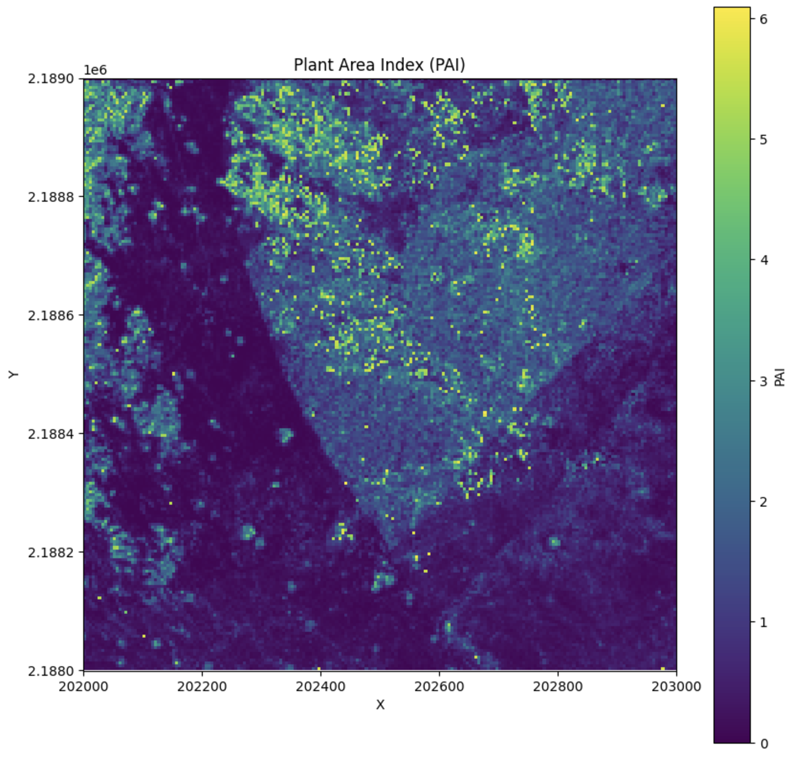

# PyForestScan: Airborne Point Cloud Analysis for Forest Structure

[](https://mybinder.org/v2/gh/iosefa/PyForestScan/HEAD?labpath=docs%2Fexamples%2Fgetting-started-importing-preprocessing-dtm-chm.ipynb)
[](https://pypi.org/project/PyForestScan/)
[](https://hub.docker.com/r/iosefa/pyforestscan)
[](https://github.com/iosefa/PyForestScan/graphs/contributors)
[](https://github.com/iosefa/PyForestScan/actions/workflows/main.yml)
[](https://codecov.io/gh/iosefa/PyForestScan)
[](https://pepy.tech/projects/pyforestscan)

**Calculate Forest Structural Metrics from lidar point clouds in Python**


## Overview

PyForestScan is a Python library designed for analyzing and visualizing forest structure using airborne 3D point cloud data. The library helps derive important forest metrics such as Canopy Height, Plant Area Index (PAI), Canopy Cover, Plant Area Density (PAD), and Foliage Height Diversity (FHD).

## Features

- **Forest Metrics**: Calculate and visualize key metrics like Canopy Height, PAI, PAD, and FHD.
- **Large Point Cloud Support**: Utilizes efficient data formats such as EPT for large point cloud processing.
- **Visualization**: Create 2D and 3D visualizations of forest structure and structural metrics
- **Extensibility**: Easily add custom filters and visualization techniques to suit your needs.

## Installation

Install PyForestScan using pip:

```bash
pip install pyforestscan
```

### Dependencies

> [!IMPORTANT]
> You MUST have installed both PDAL and GDAL to use PyForestScan. If you use conda to install PDAL, make sure you install pyforestscan in the conda environment with PDAL (and GDAL if using conda). See https://pdal.io/en/latest/ for more information on PDAL and https://gdal.org/en/stable/.

- PDAL >= 2.7
- GDAL >= 3.5
- Python >= 3.11

## Quick Start

### Calculate, Export, and Plot Plant Area Index

The following snippet shows how you can load a las file, create 5m by 5m by 1m voxels with points assigned to them, and generate plant area density at 1m layers and plant area index for each 5m grid cell before writing the resulting PAI layer to a geotiff and plotting. 

```python
from pyforestscan.handlers import read_lidar, create_geotiff
from pyforestscan.calculate import assign_voxels, calculate_pad, calculate_pai
from pyforestscan.visualize import plot_metric

arrays = read_lidar("example_data/20191210_5QKB020880.laz", "EPSG:32605", hag=True)
voxel_resolution = (5, 5, 1)
voxels, extent = assign_voxels(arrays[0], voxel_resolution)
pad = calculate_pad(voxels, voxel_resolution[-1])
pai = calculate_pai(pad)
create_geotiff(pai, "output_pai.tiff", "EPSG:32605", extent)
plot_metric('Plant Area Index', pai, extent, metric_name='PAI', cmap='viridis', fig_size=None)
```



## Documentation

For detailed instructions and examples, visit our [documentation](https://pyforestscan.sefa.ai/).

### Editing and Publishing Documentation

If you want to add new documentation or update existing docs for PyForestScan, follow these steps:

#### 1. Editing Documentation

- Documentation sources are typically found in the `docs/` directory.
- You can add new Markdown (`.md`) files or update existing ones as needed.
- To add a new doc page, simply create a new file in the `docs/` folder and link to it from the relevant index or summary page if needed.

#### 2. Building and Viewing Docs Locally

PyForestScan uses a static site generator like MkDocs (or similar) for documentation.

- Make sure you have the required dependencies listed in `requirements-doc.txt`.
- Install dependencies if needed:
  ```bash
  pip install -r requirements-doc.txt
  ```
- Build and serve the documentation locally:
  ```bash
  mkdocs serve
  ```
- Visit `http://127.0.0.1:8000` in your browser to preview your changes.

#### 3. Publishing/Updating the Documentation

- Once you are satisfied with your changes, commit and push them to your fork or branch:
  ```bash
  git add docs/
  git commit -m "Update documentation"
  git push
  ```
- Open a Pull Request (PR) if contributing to the main repository.

- On merge to the `main` branch, documentation deployment is usually handled automatically (for example, via GitHub Actions or Read the Docs). Check the repository’s specific instructions or workflows if manual steps are required.

**Tip:** If you encounter issues with the docs build or deployment, refer to any [Contributing Guidelines](docs/contributing.md), `mkdocs.yml` configuration, or open an issue for help.


## Developer Guides

To build locally and contribute to PyForestScan, you will need the following dependencies:

- PDAL and Python PDAL bindings
- GDAL
- Python
- Python requirements (requirements.txt and requirements-dev.txt)

## Testing

PyForestScan uses `pytest` for running tests. To run the tests, you can follow the steps below:

### Running Tests

1. Install the development dependencies:
   ```bash
   pip install -r requirements-dev.txt
   ```

2. Run the tests using `pytest`:
   ```bash
   pytest
   ```

This will run all the test cases under the `tests/` directory. The tests include functionality checks for filters, forest metrics, and other core components of the PyForestScan library.

You can also run specific tests by passing the test file or function name:
```bash
pytest tests/test_calculate.py
```

## Contributing

We welcome contributions! Please check our [Contributing Guidelines](docs/contributing.md) to get started.

## License

This project is licensed under the MIT License. See the [LICENSE.md](LICENSE.md) file for details.
