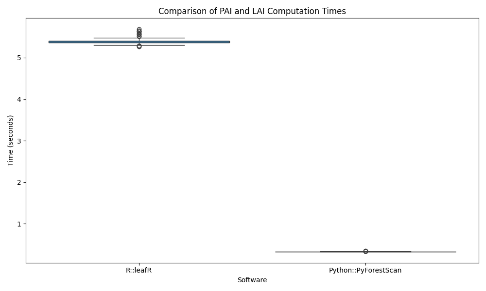

# Benchmarking

PyForestScan is designed for high performance and memory efficiency,
ensuring it can handle large-scale point cloud datasets effectively.
While no other Python libraries specifically calculate these forest
structure metrics, there are alternatives in R, such as the
[leafR]{.title-ref} library (Almeida et al. 2021), that offer similar
functionality.

We provide a direct performance comparison between PyForestScan and
[leafR]{.title-ref} to demonstrate its efficiency. In both cases, we
calculate Plant Area Index (PAI) (this is labelled as Leaf Area Index in
the [leafR]{.title-ref} library) on a LAS tile, repeating the process
100 times and plotting the results.

The benchmarks were conducted on a Mac with an Apple M3 Max processor
(16 cores) and 128GB RAM.

{.align-center
width="600px"}

\## Reference

Almeida, Danilo Roberti Alves de, Scott Christopher Stark, Carlos
Alberto Silva, Caio Hamamura, and Ruben Valbuena. 2021. "leafR:
Calculates the Leaf Area Index (LAD) and Other Related Functions."
Manual. <https://CRAN.R-project.org/package=leafR>.
