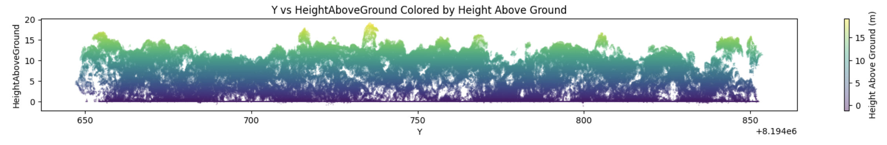

# PyForestScan Documentation

**Calculate Forest Structural Metrics from lidar point clouds in Python**

## Overview

PyForestScan is a Python library designed for analyzing and visualizing forest structure using airborne 3D point cloud data. The library helps derive important forest metrics such as Canopy Height, Plant Area Index (PAI), Canopy Cover, Plant Area Density (PAD), and Foliage Height Diversity (FHD).

## Features

- **Forest Metrics**: Calculate and visualize key metrics like Canopy Height, PAI, PAD, and FHD.
- **Large Point Cloud Support**: Utilizes efficient data formats such as EPT for large point cloud processing.
- **Visualization**: Create 2D and 3D visualizations of forest structure and structural metrics
- **Extensibility**: Easily add custom filters and visualization techniques to suit your needs.

## Examples

- [Getting Started: DTM and CHM](examples/getting-started.ipynb)
- [Calculating Forest Metrics](examples/calculate-forest-metrics.ipynb)
- [Working with Large Point Clouds](examples/working-with-large-point-clouds.ipynb)

## Attribution

This library makes heavy use of PDAL (Butler et al. 2024; Butler et al. 2021) for its IO operations. PDAL and the PDAL Python Bindings provide excellent functional support for conducting standard operations on point clouds. Our work to calculate forest structural metrics would have been a lot harder without PDAL. 

Butler, H., Bell, A., Gerlek, M. P., chambbj, Gadomski, P., Manning, C., Łoskot, M., Couwenberg, B., Barker, N., Ramsey, P., Dark, J., Mann, K., Chaulet, N., Rouault, E., Villemin, G., Foster, C., Moore, O., Rosen, M., Lewis, S., ... Brookes, D. (2024). PDAL/PDAL: 2.8.1 (Version 2.8.1). Zenodo. https://doi.org/10.5281/zenodo.13993879

Butler, H., Chambers, B., Hartzell, P., & Glennie, C. (2021). PDAL: An open source library for the processing and analysis of point clouds. Computers & Geosciences, 148, 104680. https://doi.org/https://doi.org/10.1016/j.cageo.2020.104680