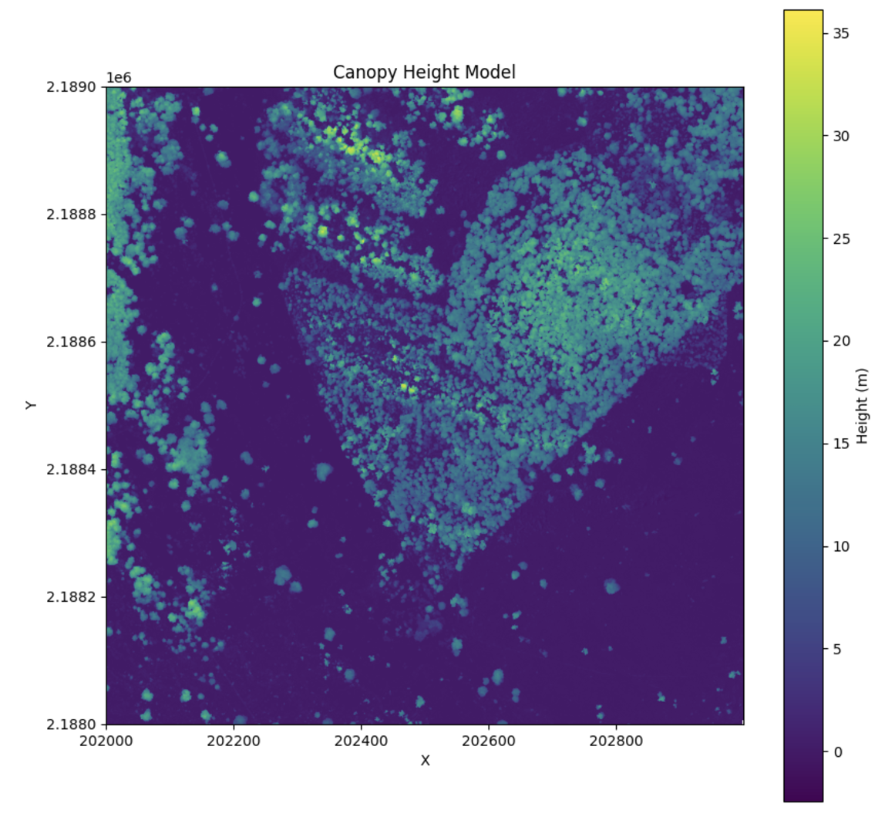
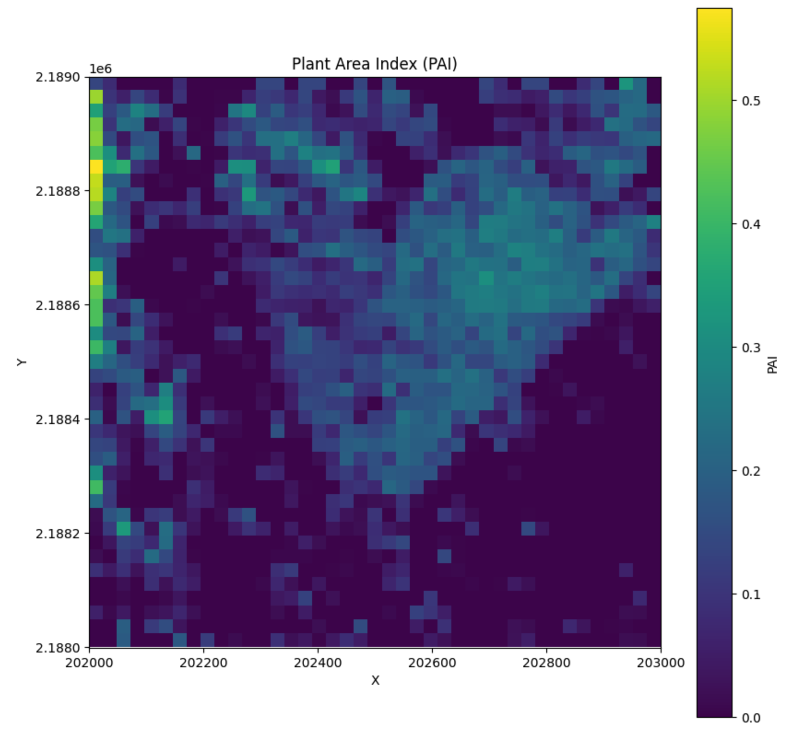

# PyForestScan Documentation

*Height Above Ground visualization of LiDAR point cloud data.*

**pyforestscan** is a Python package designed for processing
and analyzing LiDAR point cloud data. It simplifies complex LiDAR
workflows, making it easier to extract and visualize forest structure
metrics such as canopy height, plant area density, and more.

## Key Features

-   **Voxel-based Canopy Height Model (CHM) Calculation**: Generate 2D
    CHMs using voxel grids.
-   **Plant Area Density (PAD), Plant Area Index (PAI), and Foliage
    Height Diversity (FHD)**: Calculate detailed vegetation metrics with
    voxel-based methods.
-   **Digital Terrain Model (DTM) Generation**: Create terrain models
    from ground-classified points.
-   **Ground Point Classification**: Apply filters like SMRF to classify
    ground and non-ground points.
-   **Outlier Removal and Point Cloud Cleaning**: Efficiently clean data
    and remove statistical outliers.
-   **Visualization Tools**: Plot 2D and 3D representations of point
    clouds and vegetation metrics.

    <figure style="margin: 0 10px;">
        
        <figcaption style="text-align: center;">Canopy Height Model</figcaption>
    </figure>
    <figure style="margin: 0 10px;">
        
        <figcaption style="text-align: center;">Plant Area Index</figcaption>
    </figure>

## Core Modules

-   **calculate**: Includes methods for calculating CHM, PAD, PAI, and
    other vegetation metrics from voxel-based data.
-   **filters**: Provides tools for classifying ground points, applying
    height filters, and cleaning point clouds.
-   **handlers**: Functions to create GeoTIFF files, load and validate
    point cloud data, and simplify CRS transformations.
-   **visualize**: Visualization utilities to plot 2D scatter plots, PAD
    slices, and PAI data.

## Next Steps

For more details on how to get started, see the