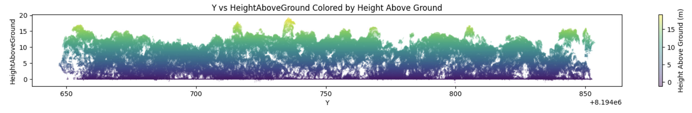

Introduction
============

   Height Above Ground visualization of LiDAR point cloud data.

`pyforestscan` is a Python package designed for processing and analyzing LiDAR point cloud data. It simplifies complex LiDAR workflows, making it easier to extract and visualize forest structure metrics such as canopy height, plant area density, and more.

Key Features
------------

- **Voxel-based Canopy Height Model (CHM) Calculation**: Generate 2D CHMs using voxel grids.
- **Plant Area Density (PAD), Plant Area Index (PAI), and Foliage Height Diversity (FHD)**: Calculate detailed vegetation metrics with voxel-based methods.
- **Digital Terrain Model (DTM) Generation**: Create terrain models from ground-classified points.
- **Ground Point Classification**: Apply filters like SMRF to classify ground and non-ground points.
- **Outlier Removal and Point Cloud Cleaning**: Efficiently clean data and remove statistical outliers.
- **Visualization Tools**: Plot 2D and 3D representations of point clouds and vegetation metrics.

.. list-table::
   :widths: 45 5 45
   :header-rows: 0

   * - .. figure:: images/chm.png
         :alt: Canopy Height Model
         :width: 300

         Canopy Height Model

     -

     - .. figure:: images/pai.png
         :alt: Plant Area Index
         :width: 300

         Plant Area Index

Core Modules
------------

- **calculate**: Includes methods for calculating CHM, PAD, PAI, and other vegetation metrics from voxel-based data.
- **filters**: Provides tools for classifying ground points, applying height filters, and cleaning point clouds.
- **handlers**: Functions to create GeoTIFF files, load and validate point cloud data, and simplify CRS transformations.
- **visualize**: Visualization utilities to plot 2D scatter plots, PAD slices, and PAI data.

Next Steps
----------

For more details on how to get started, see the :doc:`Getting Started Guide <getting_started>`.
