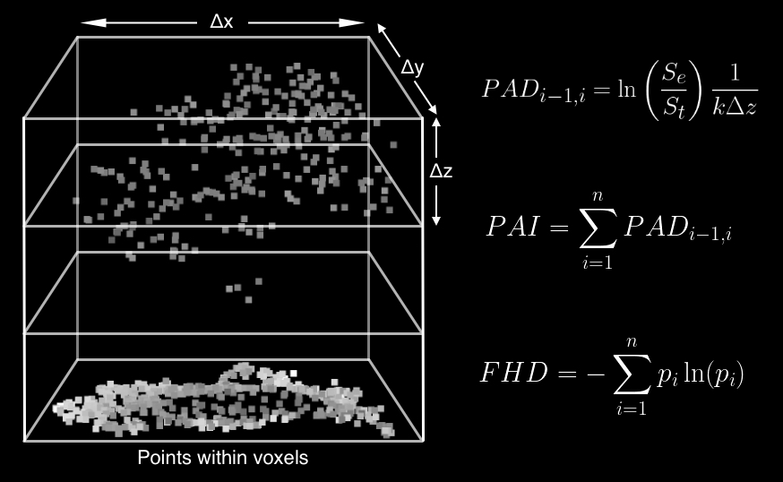

# Forest Structure Metrics Calculations

The core forest structural metrics generated by PyForestScan are based
on well-established methods in ecology.

<figure class="align-center">

<figcaption>Forest structural metrics as calculated from points within
voxels. Voxel resolution is given by Δx, Δy, Δz.</figcaption>
</figure>

## Canopy Height

Canopy height is given as the maximum height above ground for a point
within each grid cell.

$$H_{\text{canopy}} = \max(HAG_{\text{points}})$$

Where:

-   `H_{\text{canopy}}` is the canopy height for the grid cell.
-   `HAG_{\text{points}}` represents the set of heights above ground of
    all points within a given grid cell.

## Plant Area Density (PAD)

Plant Area Density (PAD) is a measure of the amount of plant material in
a vertical slice of the forest, derived from airborne LiDAR data. The
calculation follows the method outlined in Kamoske et al. 2019.

$$PAD_{i-1,i} = \ln\left(\frac{S_e}{S_t}\right) \frac{1}{k \Delta z}$$

Where:

-   `PAD_{i-1,i}` represents the Plant Area Density between two adjacent
    voxels, indexed by ( i-1 ) and ( i ).
-   ( S_e ) is the number of lidar pulses entering the voxel.
-   ( S_t ) is the number of lidar pulses exiting the voxel.
-   ( k ) is the extinction coefficient from the Beer-Lambert Law.
-   ( Delta z ) is the height of each voxel.

The equation calculates the natural logarithm of the ratio of entering
and exiting lidar pulses, scaled by the inverse of the extinction
coefficient and the voxel height. This quantifies the density of plant
material between the two voxels.

## Plant Area Index (PAI)

Plant Area Index (PAI) is a measure of the total plant material in a
vertical column of the forest. It is calculated as the sum of the Plant
Area Density (PAD) across all layers in the canopy.

$$PAI = \sum_{i=1}^{n} PAD_{i-1,i}$$

Where:

-   `PAI` is the Plant Area Index.
-   ( [PAD](){i-1,i} ) is the Plant Area Density between adjacent layers
    ( i-1 ) and ( i ).
-   ( n ) is the total number of layers in the vertical column.

PAI provides an aggregated view of plant material from the ground to the
top of the canopy by summing the PAD for each vertical layer.

## Foliage Height Diversity (FHD)

Foliage Height Diversity (FHD) is a metric that quantifies the vertical
distribution of plant material in the forest canopy. It is based on
Shannon entropy and calculated using methods derived from Hurlbert
(1971) and MacArthur & MacArthur (1961).

$$FHD = - \sum_{i=1}^{n} p_i \ln(p_i)$$

Where:

-   `FHD` is the Foliage Height Diversity.
-   ( p_i ) is the proportion of total plant material in voxel ( i )
    relative to the entire vertical column.
-   ( n ) is the number of vertical layers in the canopy.

FHD provides an indication of how plant material is distributed
vertically, with higher values suggesting a more even distribution of
foliage across different height levels.

## References

Hurlbert, Stuart H. 1971. "The Nonconcept of Species Diversity: A
Critique and Alternative Parameters." Ecology 52 (4): 577--86.
<https://doi.org/10.2307/1934145>.

Kamoske, Aaron G., Kyla M. Dahlin, Scott C. Stark, and Shawn P. Serbin.
2019. "Leaf Area Density from Airborne LiDAR: Comparing Sensors and
Resolutions in a Temperate Broadleaf Forest Ecosystem." Forest Ecology
and Management 433 (February): 364--75.
<https://doi.org/10.1016/j.foreco.2018.11.017>.

MacArthur, Robert H., and John W. MacArthur. 1961. "On Bird Species
Diversity." Ecology 42 (3): 594--98. <https://doi.org/10.2307/1932254>.
