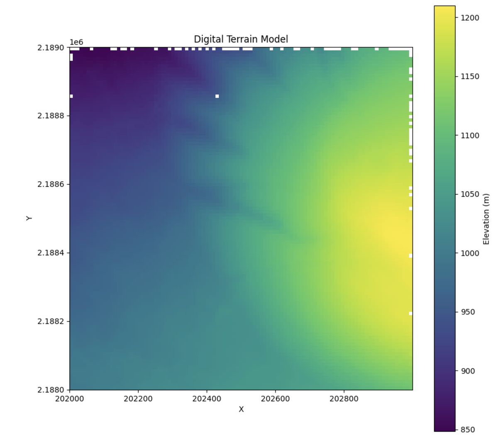

# Digital Terrain Models

Given a classified point cloud, pyforestscan can create, save, and visualize digital terrain models (DTMs) as geotiffs:

```python
from pyforestscan.calculate import generate_dtm
from pyforestscan.filters import filter_select_ground
from pyforestscan.handlers import create_geotiff
from pyforestscan.visualize import plot_metric

ground_points = filter_select_ground(classified_arrays)

dtm, extent = generate_dtm(ground_points, resolution=10.0)

create_geotiff(dtm, "../example_data/20191210_5QKB020880_DS05_dtm.tif", "EPSG:32605", extent)

plot_metric('Digital Terrain Model', dtm, extent, metric_name='Elevation (m)', cmap='viridis', fig_size=None)
```



