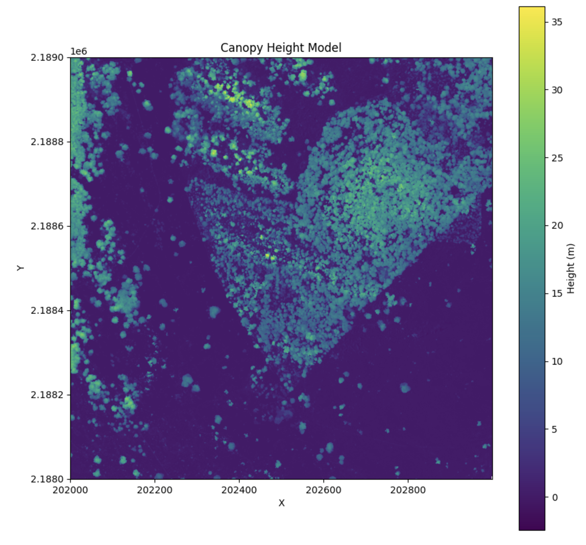

# Canopy Height Models (CHM)

## Theory

Canopy height is given as the maximum height above ground for a point within each grid cell or for all points within a given polygon.

$$ H_{\text{canopy}} = \max(HAG_{\text{points}}) $$

Where:

-   \( H_{\text{canopy}} \) is the canopy height for the grid cell or polygon.
-   \( HAG_{\text{points}} \) represents the set of heights above ground of all points within a given grid cell or polygon.

## Calculating CHM
To calculate canopy height and generate a canopy height model:

```python
from pyforestscan.handlers import read_lidar
from pyforestscan.visualize import plot_metric
from pyforestscan.calculate import calculate_chm

file_path = "../example_data/20191210_5QKB020880.laz"
arrays = read_lidar(file_path, "EPSG:32605", hag=True)
chm, extent = calculate_chm(arrays[0], (1,1,1))
plot_metric("Canopy Height Model", chm, extent, metric_name='Height (m)', cmap='viridis', fig_size=None)
```



## Gridded CHM
PyForestScan uses PDAL and Entwine to read and process large files stored in the EPT format. These can be used to create gridded metrics, like CHM. To create a 1km grid of CHM:

```python
from pyforestscan.process import process_with_tiles

ept = "../example_data/ept/ept.json"
ept_srs = "EPSG:32605"

process_with_tiles(
    ept, 
    (1000, 1000), 
    "../example_data/tiles", 
    "chm", 
    (5, 5, 1), 
    buffer_size=0.15,
    srs="EPSG:32605"
)
```

If the EPT covers a very large area and the gridded metrics should only cover a fraction of that area, you can provide the tile processor with the bounds of the region that you want to tile:

```python
bounds = ([202000.000, 205000.000], [2186999.980, 2190000.000])
process_with_tiles(
    ept, 
    (1000, 1000), 
    "../example_data/tiles", 
    "pai", 
    (5, 5, 1), 
    buffer_size=0.15,
    srs="EPSG:32605",
    bounds=bounds
)
```

## Canopy Height for Abstract Polygons
It is also possible to read a point cloud and clip it to a polygon in order to extract metrics for that region clipped by the polygon. For example, with the polygon of a tree, we can clip the points to that tree and extact the canopy height:

```python
import geopandas as gpd
from pyforestscan.handlers import read_lidar
from pyforestscan.visualize import plot_2d

ept = "../example_data/ept/ept.json"
ept_srs = "EPSG:32605"

crowns = gpd.read_file("../example_data/test_segment.gpkg")
crown_geom = crowns.geometry.iloc[0]
minx, miny, maxx, maxy = crown_geom.bounds
bounds = ([minx, maxx], [miny, maxy])
pointclouds = read_lidar(ept, ept_srs, bounds, crop_poly=True, poly=crown_geom.wkt)
plot_2d(pointclouds[0], x_dim='X', y_dim='Z', alpha=0.5, point_size=50, fig_size=(10, 10))
```

