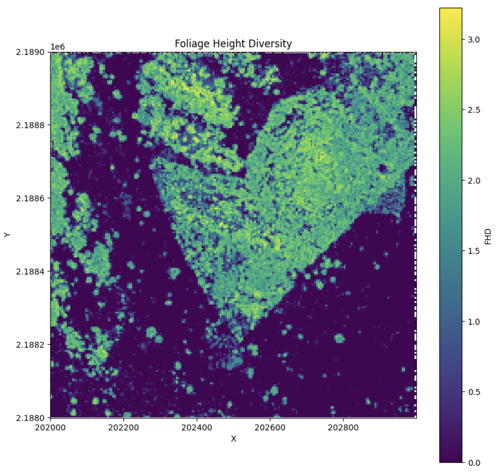

# Foliage Height Diversity (FHD)

## Theory

Foliage Height Diversity (FHD) is a metric that quantifies the vertical distribution of plant material in the forest canopy. It is based on Shannon entropy and calculated using methods derived from Hurlbert (1971) and MacArthur & MacArthur (1961).

$$ FHD = - \sum_{i=1}^{n} p_i \ln(p_i) $$

Where:
-   \( FHD \) is the Foliage Height Diversity.
-   \( p_i \) is the proportion of total plant material in voxel \( i \) relative to the entire vertical column.
-   \( n \) is the number of vertical layers in the canopy.

FHD provides an indication of how plant material is distributed vertically, with higher values suggesting a more even distribution of foliage across different height levels.

## Calculating FHD

To calculate FHD:

```python
from pyforestscan.handlers import read_lidar
from pyforestscan.visualize import plot_metric
from pyforestscan.filters import filter_hag
from pyforestscan.calculate import assign_voxels, calculate_fhd

file_path = "../example_data/20191210_5QKB020880.laz"
arrays = read_lidar(file_path, "EPSG:32605", hag=True)
arrays = filter_hag(arrays)
points = arrays[0]

voxel_resolution = (5, 5, 1) 
voxels, extent = assign_voxels(points, voxel_resolution)

fhd = calculate_fhd(voxels)
plot_metric('Foliage Height Diversity', fhd, extent, metric_name='FHD', cmap='viridis', fig_size=None)
```



## References

Hurlbert, Stuart H. 1971. "The Nonconcept of Species Diversity: A
Critique and Alternative Parameters." Ecology 52 (4): 577--86.
<https://doi.org/10.2307/1934145>.

MacArthur, Robert H., and John W. MacArthur. 1961. "On Bird Species
Diversity." Ecology 42 (3): 594--98. <https://doi.org/10.2307/1932254>.
