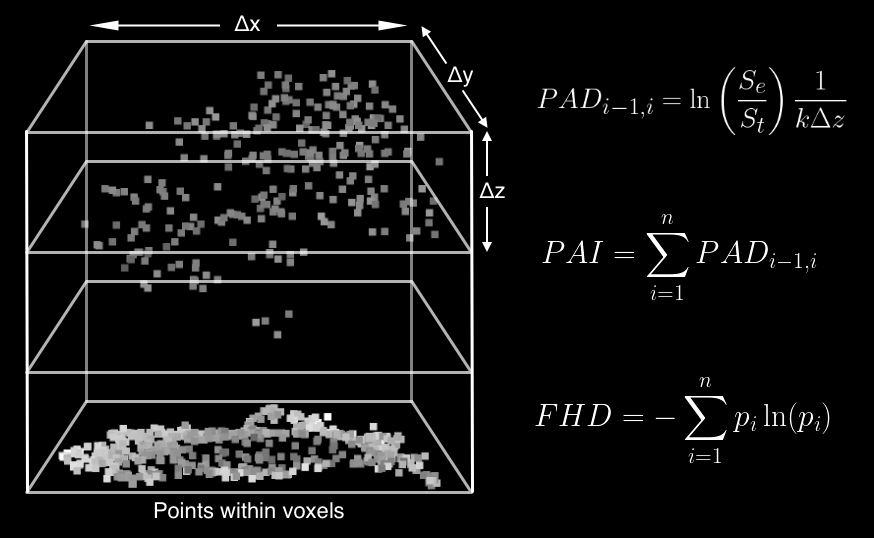

# Introduction

The core forest structural metrics generated by PyForestScan are based on well-established methods in ecology.

<figcaption align="center">Forest structural metrics as calculated from points within voxels. Voxel resolution is given by Δx, Δy, Δz.</figcaption>

Most calculations for the metrics follows the method outlined in Kamoske et al. 2019.

## Metrics

* [Canopy Height Models (CHM)](chm.md)
* [Plant Area Density (PAD)](pad.md)
* [Plant Area Index (PAI)](pai.md)
* [Foliage Height Diversity (FHD)](fhd.md)
* [Canopy Cover](canopy_cover.md)

## References

Kamoske, Aaron G., Kyla M. Dahlin, Scott C. Stark, and Shawn P. Serbin.
2019. "Leaf Area Density from Airborne LiDAR: Comparing Sensors and
Resolutions in a Temperate Broadleaf Forest Ecosystem." Forest Ecology
and Management 433 (February): 364--75.
<https://doi.org/10.1016/j.foreco.2018.11.017>.
