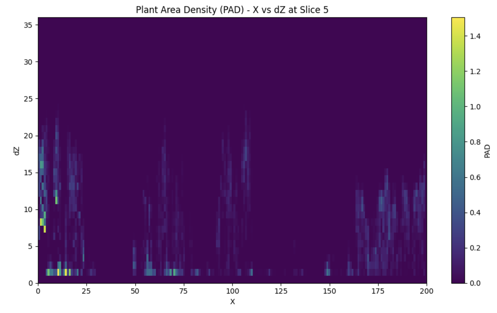

# Plant Area Density (PAD)

## Theory

Plant Area Density (PAD) is a measure of the amount of plant material in a vertical slice of the forest, derived from airborne LiDAR data. The calculation follows the method outlined in Kamoske et al. 2019.

$$PAD_{i-1,i} = \ln\left(\frac{S_e}{S_t}\right) \frac{1}{k \Delta z}$$

Where:

-   `PAD_{i-1,i}` represents the Plant Area Density between two adjacent
    voxels, indexed by ( i-1 ) and ( i ).
-   ( S_e ) is the number of lidar pulses entering the voxel.
-   ( S_t ) is the number of lidar pulses exiting the voxel.
-   ( k ) is the extinction coefficient from the Beer-Lambert Law.
-   ( Delta z ) is the height of each voxel.

The equation calculates the natural logarithm of the ratio of entering and exiting lidar pulses, scaled by the inverse of the extinction coefficient and the voxel height. This quantifies the density of plant material between the two voxels.

## Calculating PAD

To calculate PAD:

```python
from pyforestscan.handlers import read_lidar
from pyforestscan.visualize import plot_pad
from pyforestscan.filters import filter_hag
from pyforestscan.calculate import assign_voxels, calculate_pad

file_path = "../example_data/20191210_5QKB020880.laz"
arrays = read_lidar(file_path, "EPSG:32605", hag=True)
arrays = filter_hag(arrays)
points = arrays[0]

voxel_resolution = (5, 5, 1) 
voxels, extent = assign_voxels(points, voxel_resolution)

pad = calculate_pad(voxels, voxel_resolution[-1])
plot_pad(pad, 5, axis='y', cmap='viridis')
```



## References

Kamoske, Aaron G., Kyla M. Dahlin, Scott C. Stark, and Shawn P. Serbin.
2019. "Leaf Area Density from Airborne LiDAR: Comparing Sensors and
Resolutions in a Temperate Broadleaf Forest Ecosystem." Forest Ecology
and Management 433 (February): 364--75.
<https://doi.org/10.1016/j.foreco.2018.11.017>.
